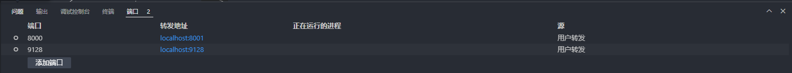
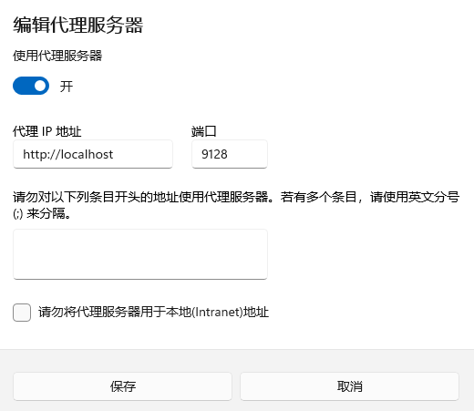

[Release Fix XSS protection · vnotex/vnote · GitHub](https://github.com/vnotex/vnote/releases/tag/v3.18.2)

> ## 按照配置squid，前向代理软件

sudo vim  /etc/squid/squid.conf

acl all src 0.0.0.0/0
http_access allow all

cache_mem 1024 MB
cache_dir ufs /var/spool/squid 10000 16 256

vscode 工具  右下角的操作页面，选择端口菜单

第一列端口栏添加指定的9128端口，生成转发地址栏localhost:9128

本地设置->网络->代理->手动设置代理

http://localhost

9128

[yubang@yangs-dev mds]$ lsof -i:9128

COMMAND    PID   USER   FD   TYPE DEVICE SIZE/OFF NODE NAME
node    145487 yubang   52u  IPv6 397659      0t0  TCP localhost:39122->localhost:9128 (ESTABLISHED)
node    145487 yubang   63u  IPv6 392192      0t0  TCP localhost:52914->localhost:9128 (ESTABLISHED)
node    145487 yubang   71u  IPv6 402434      0t0  TCP localhost:52928->localhost:9128 (ESTABLISHED)
node    145487 yubang  136u  IPv6 402436      0t0  TCP localhost:55446->localhost:9128 (ESTABLISHED)
node    145487 yubang  144u  IPv6 392468      0t0  TCP localhost:34186->localhost:9128 (ESTABLISHED)
node    145487 yubang  245u  IPv6 397364      0t0  TCP localhost:40844->localhost:9128 (ESTABLISHED)
node    145487 yubang  246u  IPv6 397366      0t0  TCP localhost:40872->localhost:9128 (ESTABLISHED)
node    145487 yubang  249u  IPv6 397368      0t0  TCP localhost:40884->localhost:9128 (ESTABLISHED)
node    145487 yubang  251u  IPv6 397371      0t0  TCP localhost:40906->localhost:9128 (ESTABLISHED)
node    145487 yubang  252u  IPv6 397372      0t0  TCP localhost:40914->localhost:9128 (ESTABLISHED)
node    145487 yubang  259u  IPv6 397374      0t0  TCP localhost:40936->localhost:9128 (ESTABLISHED)
node    145487 yubang  262u  IPv6 397376      0t0  TCP localhost:40952->localhost:9128 (ESTABLISHED)
node    145487 yubang  317u  IPv6 386885      0t0  TCP localhost:57246->localhost:9128 (ESTABLISHED)
node    145487 yubang  448u  IPv6 390106      0t0  TCP localhost:59190->localhost:9128 (ESTABLISHED)
[yubang@yangs-dev mds]$
[yubang@yangs-dev mds]$
[yubang@yangs-dev mds]$ lsof -p 145487
COMMAND    PID   USER   FD      TYPE             DEVICE SIZE/OFF      NODE NAME
node    145487 yubang  cwd       DIR                8,3     4096    469676 /home/yubang
node    145487 yubang  rtd       DIR                8,3      235       128 /
node    145487 yubang  txt       REG                8,3 98022736  33555657 /home/yubang/.vscode-server/cli/servers/Stable-fee1edb8d6d72a0ddff41e5f71a671c23ed924b9/server/node
node    145487 yubang  mem       REG                8,3    43968  33555672 /home/yubang/.vscode-server/cli/servers/Stable-fee1edb8d6d72a0ddff41e5f71a671c23ed924b9/server/node_modules/vsda/build/Release/vsda.node
node    145487 yubang  mem       REG                8,3   525320 101432590 /home/yubang/.vscode-server/cli/servers/Stable-fee1edb8d6d72a0ddff41e5f71a671c23ed924b9/server/node_modules/@vscode/spdlog/build/Release/spdlog.node
node    145487 yubang  mem       REG                8,3  2592552  67240566 /usr/lib64/libc.so.6
node    145487 yubang  mem       REG                8,3   914360  67240570 /usr/lib64/libm.so.6
node    145487 yubang  mem       REG                8,3  2314576  67312652 /usr/lib64/libstdc++.so.6.0.29
node    145487 yubang  mem       REG                8,3    15648  67254785 /usr/lib64/libpthread.so.0
node    145487 yubang  mem       REG                8,3   108136  67240073 /usr/lib64/libgcc_s-11-20231218.so.1
node    145487 yubang  mem       REG                8,3    15632  67240569 /usr/lib64/libdl.so.2
node    145487 yubang  mem       REG                8,3   861816  67240561 /usr/lib64/ld-linux-x86-64.so.2
node    145487 yubang    0r      CHR                1,3      0t0         4 /dev/null
node    145487 yubang    1w     FIFO               0,13      0t0    382693 pipe
node    145487 yubang    2w     FIFO               0,13      0t0    382694 pipe
node    145487 yubang    3u  a_inode               0,14        0      1057 [eventpoll]
node    145487 yubang    4r     FIFO               0,13      0t0    378632 pipe
node    145487 yubang    5w     FIFO               0,13      0t0    378632 pipe
node    145487 yubang    6r     FIFO               0,13      0t0    378633 pipe
node    145487 yubang    7w     FIFO               0,13      0t0    378633 pipe
node    145487 yubang    8u  a_inode               0,14        0      1057 [eventfd:10]
node    145487 yubang    9u  a_inode               0,14        0      1057 [eventpoll:10,12]
node    145487 yubang   10r     FIFO               0,13      0t0    380684 pipe
node    145487 yubang   11w     FIFO               0,13      0t0    380684 pipe
node    145487 yubang   12u  a_inode               0,14        0      1057 [eventfd:11]
node    145487 yubang   13u  a_inode               0,14        0      1057 [eventpoll:20,25,40,41,42,43,44,45,46,47,48,49,62,63,64,71,72,73,102,135,136,176,235,237,238,245,246,249,251,252,259,262...]
node    145487 yubang   14r     FIFO               0,13      0t0    378634 pipe
node    145487 yubang   15w     FIFO               0,13      0t0    378634 pipe
node    145487 yubang   16u  a_inode               0,14        0      1057 [eventfd:12]
node    145487 yubang   17r      CHR                1,3      0t0         4 /dev/null
node    145487 yubang   18u     unix 0x0000000000000000      0t0    378639 /tmp/code-31d010b1-f8f8-46de-ad26-bbcbe72212d9 type=STREAM (LISTEN)
node    145487 yubang   19w      REG                8,3        0 101784168 /home/yubang/.vscode-server/data/logs/20240905T080348/network.log
node    145487 yubang   20u     unix 0x0000000000000000      0t0    375442 type=STREAM (CONNECTED)
node    145487 yubang   21u     unix 0x0000000000000000      0t0    378673 /tmp/code-31d010b1-f8f8-46de-ad26-bbcbe72212d9 type=STREAM (CONNECTED)
node    145487 yubang   22r  a_inode               0,14        0      1057 inotify
node    145487 yubang   23w      REG                8,3     7587 101784166 /home/yubang/.vscode-server/data/logs/20240905T080348/remoteagent.log
node    145487 yubang   24u     unix 0x0000000000000000      0t0    378674 type=STREAM (CONNECTED)
node    145487 yubang   25u     unix 0x0000000000000000      0t0    381746 /run/user/1000/vscode-ipc-a23a9971-7713-4e21-9cdf-a2c3a6037445.sock type=STREAM (LISTEN)
node    145487 yubang   26u     unix 0x0000000000000000      0t0    378676 type=STREAM (CONNECTED)
node    145487 yubang   27u     unix 0x0000000000000000      0t0    378857 /tmp/code-31d010b1-f8f8-46de-ad26-bbcbe72212d9 type=STREAM (CONNECTED)
node    145487 yubang   28u     unix 0x0000000000000000      0t0    378678 type=STREAM (CONNECTED)
node    145487 yubang   29u     unix 0x0000000000000000      0t0    379831 /run/user/1000/vscode-ipc-987b7a6a-4110-497f-826a-886c180f2157.sock type=STREAM (LISTEN)
node    145487 yubang   30u     unix 0x0000000000000000      0t0    378680 type=STREAM (CONNECTED)
node    145487 yubang   31u     unix 0x0000000000000000      0t0    378858 type=STREAM (CONNECTED)
node    145487 yubang   32u     unix 0x0000000000000000      0t0    388205 /tmp/code-31d010b1-f8f8-46de-ad26-bbcbe72212d9 type=STREAM (CONNECTED)
node    145487 yubang   33u     unix 0x0000000000000000      0t0    378860 type=STREAM (CONNECTED)
node    145487 yubang   34u     unix 0x0000000000000000      0t0    388206 /tmp/code-31d010b1-f8f8-46de-ad26-bbcbe72212d9 type=STREAM (CONNECTED)
node    145487 yubang   35u     unix 0x0000000000000000      0t0    378862 type=STREAM (CONNECTED)
node    145487 yubang   36u     IPv6             388207      0t0       TCP localhost:35696->localhost:irdmi (ESTABLISHED)
node    145487 yubang   37u     unix 0x0000000000000000      0t0    378864 type=STREAM (CONNECTED)
node    145487 yubang   38u     unix 0x0000000000000000      0t0    386242 /run/user/1000/vscode-ipc-bb44e146-16f4-4732-8a65-ddfde8117c8d.sock type=STREAM (LISTEN)
node    145487 yubang   39u     IPv6             388208      0t0       TCP localhost:35710->localhost:irdmi (ESTABLISHED)
node    145487 yubang   40u     unix 0x0000000000000000      0t0    388226 /tmp/code-31d010b1-f8f8-46de-ad26-bbcbe72212d9 type=STREAM (CONNECTED)
node    145487 yubang   41u     IPv6             388227      0t0       TCP localhost:42296->localhost:irdmi (ESTABLISHED)
node    145487 yubang   42u     unix 0x0000000000000000      0t0    388336 /tmp/code-31d010b1-f8f8-46de-ad26-bbcbe72212d9 type=STREAM (CONNECTED)
node    145487 yubang   43u     unix 0x0000000000000000      0t0    388337 /tmp/code-31d010b1-f8f8-46de-ad26-bbcbe72212d9 type=STREAM (CONNECTED)
node    145487 yubang   44u     IPv6             388338      0t0       TCP localhost:40472->localhost:irdmi (ESTABLISHED)
node    145487 yubang   45u     IPv6             388339      0t0       TCP localhost:40484->localhost:irdmi (ESTABLISHED)
node    145487 yubang   46u     unix 0x0000000000000000      0t0    393283 /tmp/code-31d010b1-f8f8-46de-ad26-bbcbe72212d9 type=STREAM (CONNECTED)
node    145487 yubang   47u     unix 0x0000000000000000      0t0    393284 /tmp/code-31d010b1-f8f8-46de-ad26-bbcbe72212d9 type=STREAM (CONNECTED)
node    145487 yubang   48u     IPv6             393285      0t0       TCP localhost:54560->localhost:irdmi (ESTABLISHED)
node    145487 yubang   49u     IPv6             393286      0t0       TCP localhost:54564->localhost:irdmi (ESTABLISHED)
node    145487 yubang   50u     unix 0x0000000000000000      0t0    389312 /run/user/1000/vscode-ipc-8a2af4c1-5041-4078-8dd0-92e41144aad5.sock type=STREAM (LISTEN)
node    145487 yubang   51u     unix 0x0000000000000000      0t0    397658 /tmp/code-31d010b1-f8f8-46de-ad26-bbcbe72212d9 type=STREAM (CONNECTED)
node    145487 yubang   52u     IPv6             397659      0t0       TCP localhost:39122->localhost:9128 (ESTABLISHED)
node    145487 yubang   58u     unix 0x0000000000000000      0t0    378683 type=STREAM (CONNECTED)
node    145487 yubang   62u     unix 0x0000000000000000      0t0    392191 /tmp/code-31d010b1-f8f8-46de-ad26-bbcbe72212d9 type=STREAM (CONNECTED)
node    145487 yubang   63u     IPv6             392192      0t0       TCP localhost:52914->localhost:9128 (ESTABLISHED)
node    145487 yubang   64u     unix 0x0000000000000000      0t0    402433 /tmp/code-31d010b1-f8f8-46de-ad26-bbcbe72212d9 type=STREAM (CONNECTED)
node    145487 yubang   71u     IPv6             402434      0t0       TCP localhost:52928->localhost:9128 (ESTABLISHED)
node    145487 yubang   72u     unix 0x0000000000000000      0t0    391466 /tmp/code-31d010b1-f8f8-46de-ad26-bbcbe72212d9 type=STREAM (CONNECTED)
node    145487 yubang   73u     IPv6             391467      0t0       TCP localhost:44584->localhost:irdmi (ESTABLISHED)
node    145487 yubang   76u     unix 0x0000000000000000      0t0    378867 type=STREAM (CONNECTED)
node    145487 yubang  102u     unix 0x0000000000000000      0t0    397358 /tmp/code-31d010b1-f8f8-46de-ad26-bbcbe72212d9 type=STREAM (CONNECTED)
node    145487 yubang  135u     unix 0x0000000000000000      0t0    402435 /tmp/code-31d010b1-f8f8-46de-ad26-bbcbe72212d9 type=STREAM (CONNECTED)
node    145487 yubang  136u     IPv6             402436      0t0       TCP localhost:55446->localhost:9128 (ESTABLISHED)
node    145487 yubang  143u     unix 0x0000000000000000      0t0    392467 /tmp/code-31d010b1-f8f8-46de-ad26-bbcbe72212d9 type=STREAM (CONNECTED)
node    145487 yubang  144u     IPv6             392468      0t0       TCP localhost:34186->localhost:9128 (ESTABLISHED)
node    145487 yubang  171u     unix 0x0000000000000000      0t0    397360 /tmp/code-31d010b1-f8f8-46de-ad26-bbcbe72212d9 type=STREAM (CONNECTED)
node    145487 yubang  176u     unix 0x0000000000000000      0t0    397361 /tmp/code-31d010b1-f8f8-46de-ad26-bbcbe72212d9 type=STREAM (CONNECTED)
node    145487 yubang  235u     unix 0x0000000000000000      0t0    389061 /tmp/code-31d010b1-f8f8-46de-ad26-bbcbe72212d9 type=STREAM (CONNECTED)
node    145487 yubang  237u     unix 0x0000000000000000      0t0    389063 /tmp/code-31d010b1-f8f8-46de-ad26-bbcbe72212d9 type=STREAM (CONNECTED)
node    145487 yubang  238u     unix 0x0000000000000000      0t0    389064 /tmp/code-31d010b1-f8f8-46de-ad26-bbcbe72212d9 type=STREAM (CONNECTED)
node    145487 yubang  241u     unix 0x0000000000000000      0t0    396430 /tmp/code-31d010b1-f8f8-46de-ad26-bbcbe72212d9 type=STREAM (CONNECTED)
node    145487 yubang  245u     IPv6             397364      0t0       TCP localhost:40844->localhost:9128 (ESTABLISHED)
node    145487 yubang  246u     IPv6             397366      0t0       TCP localhost:40872->localhost:9128 (ESTABLISHED)
node    145487 yubang  249u     IPv6             397368      0t0       TCP localhost:40884->localhost:9128 (ESTABLISHED)
node    145487 yubang  251u     IPv6             397371      0t0       TCP localhost:40906->localhost:9128 (ESTABLISHED)
node    145487 yubang  252u     IPv6             397372      0t0       TCP localhost:40914->localhost:9128 (ESTABLISHED)
node    145487 yubang  259u     IPv6             397374      0t0       TCP localhost:40936->localhost:9128 (ESTABLISHED)
node    145487 yubang  262u     IPv6             397376      0t0       TCP localhost:40952->localhost:9128 (ESTABLISHED)
node    145487 yubang  313u     unix 0x0000000000000000      0t0    386881 /tmp/code-31d010b1-f8f8-46de-ad26-bbcbe72212d9 type=STREAM (CONNECTED)
node    145487 yubang  317u     IPv6             386885      0t0       TCP localhost:57246->localhost:9128 (ESTABLISHED)
node    145487 yubang  447u     unix 0x0000000000000000      0t0    390105 /tmp/code-31d010b1-f8f8-46de-ad26-bbcbe72212d9 type=STREAM (CONNECTED)
node    145487 yubang  448u     IPv6             390106      0t0       TCP localhost:59190->localhost:9128 (ESTABLISHED)
